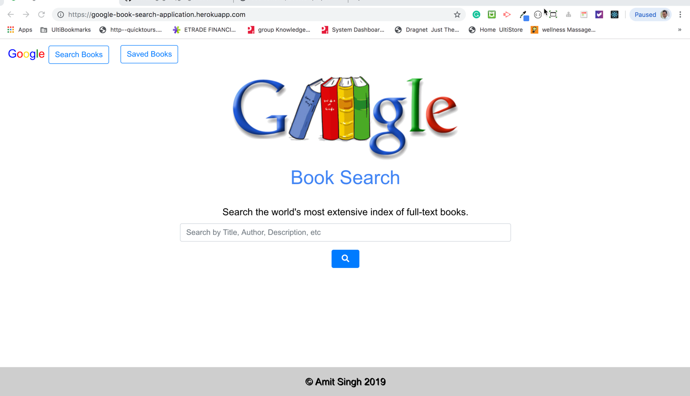

# google-books-react-search

A simple Book Search app using React JS and Google Books API

# What This Application Does

* Search Books - User can search for books via the `Google Books API` and render them here. User has the option to "View" a book, bringing them to the book on Google Books, or "Save" a book, saving it to the `Mongo` database.

* Saved Books - Renders all books saved to the `Mongo` database. User has an option to "View" the book, bringing them to the book on Google Books, or "Delete" a book, removing it from the `Mongo` database.

## Credits :

- [React JS.](http://facebook.github.io/react/)
- [Google Books API](https://developers.google.com/books/?hl=en)
- [Twitter Bootstrap](http://getbootstrap.com)
- [Font Awesome](https://fontawesome.com/)

Create by : [Amit K Singh](https://github.com/amitsinghgh19) © 2019

